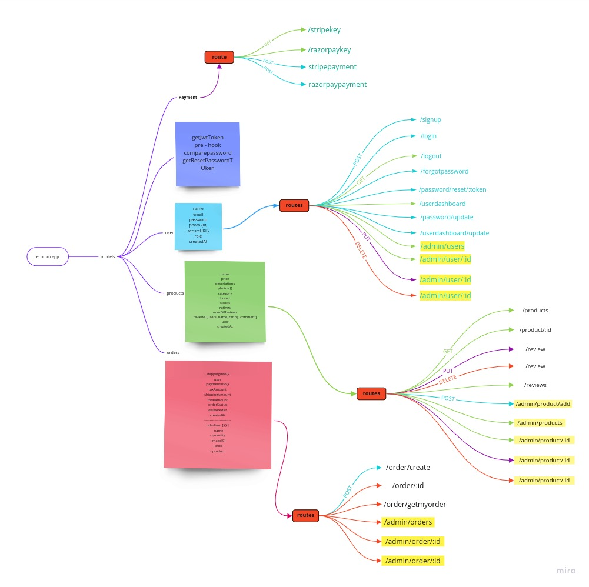

# E-Commerse-Tshirt-Store

## A ecommerse RestAPI server that uses NodeJs and MongoDB

This is a tshirt store project that has several features like role based access, payments, sessions, file-upload, database CRUD operations.

- It used NodeJs express library for creating RestAPIs.
- It uses MongoDB for data persistance.
